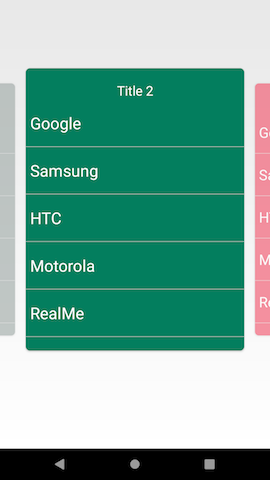

# ViewPagerCarousel

### ViewPager Carousel can be used as Top Level Navigation or as a Image / Video Gallery View


<!--- <a href="https://imgflip.com/gif/2557e5"></a> --->
this is for screenshot 
this is for screenshot 
## Getting Started

### setup pager in layout.xml:
```
<com.ramsoft.viewswipe.CustomViewPager xmlns:android="http://schemas.android.com/apk/res/android"
         android:id="@+id/custom_view_pager"
        android:layout_width="match_parent"
        android:layout_height="match_parent"
       />
```
### setup pager in you Fragment or Activity :
```
 mPager = (CustomViewPager) findViewById(R.id.custom_view_pager);
mPager.setAdapter(new ItemFragmentAdapter(getSupportFragmentManager(),
                MainActivity.this, CONTENT2));
```

### Adjust Page Spacing :
 
Adjust Page Spacing only if defalult(40dp) is not giving the desired result  :
you can adjust page spacing by set calling method
```
mPager.setPageMargin(marging in pixels);
```
### Enable/Desable scale and fading animation:
```
mPager.setAnimationEnabled(true/false);
```
### Enable/Desable fading animation and configure fading factor:
```
mPager.setFadeEnabled(true);
mPager.setFadeFactor(0.6f);
```
# ViewPagerCarousel
